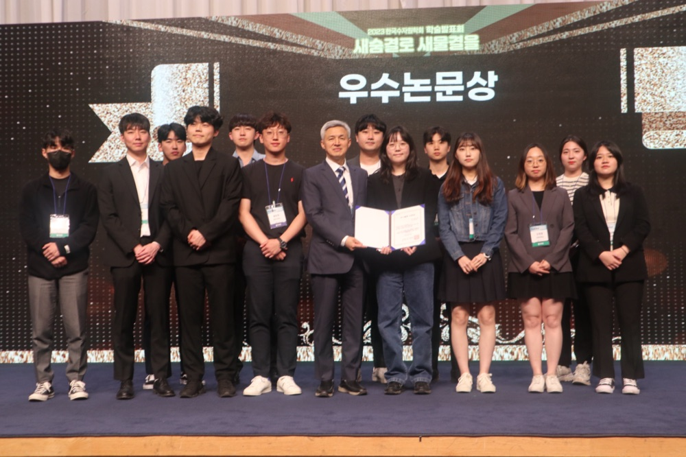
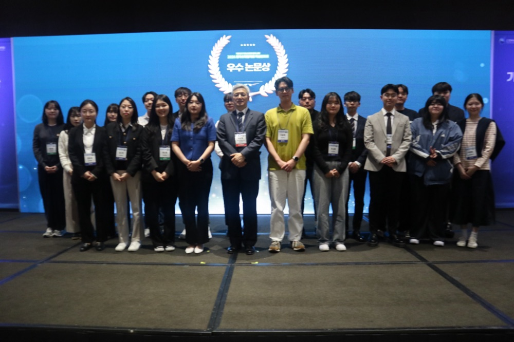
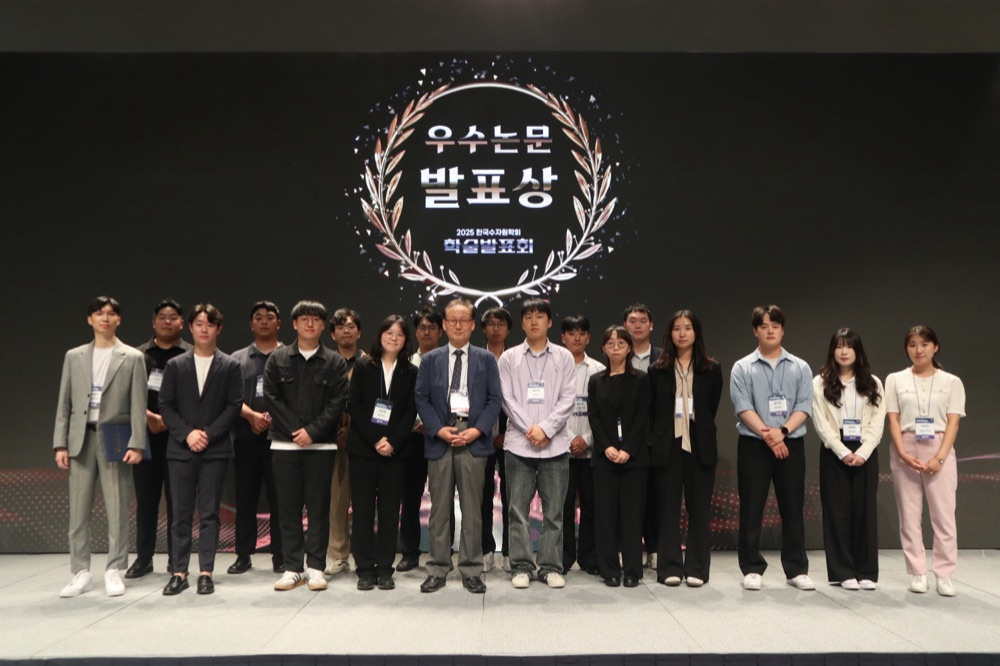

## About Me

I am a researcher in hydrology and hydrometeorology. I received my M.S. in Civil Engineering from Hongik University, Seoul, where I was advised by [Prof. Dongkyun Kim](https://sites.google.com/site/hihydrology/home). My research focuses on extreme rainfall — how to better predict it with deep learning, and how urbanization reshapes it. I am currently applying to Ph.D. programs in the United States.

## Research Interests

- **Extreme Rainfall & Urban Hydrometeorology:** urbanization effects on extreme precipitation, long-term gridded rainfall analysis (AORC)
- **Deep Learning in Hydrology:** precipitation nowcasting, ConvLSTM, weighted loss functions for extreme events



## News

- **[Jun. 2026]** I am visiting the [TExUS Lab](https://texuslab.org/) at the University of Texas at Austin as a visiting researcher (Jun. 15 – Sep. 3, 2026), working with [Prof. Dev Niyogi](https://www.jsg.utexas.edu/researcher/dev_niyogi/).
- **[Jul. 2025]** Our paper on weighted loss functions for extreme rainfall nowcasting is published in *IEEE Transactions on Geoscience and Remote Sensing*.
- **[May 2025]** I received the Excellent Paper Presentation Award at the *2025 Korea Water Resources Association Conference*.
- **[Apr. 2025]** I presented our work on extreme rainfall nowcasting at the *EGU General Assembly 2025* in Vienna, Austria.
- **[May 2024]** I received the Excellent Paper Presentation Award at the *2024 Korea Water Resources Association Conference*.
- **[May 2023]** I received the Excellent Paper Presentation Award at the *2023 Korea Water Resources Association Conference*.

  

    
    <small><b>2023</b> KWRA Conference</small>
  

  

    
    <small><b>2024</b> KWRA Conference</small>
  

  

    
    <small><b>2025</b> KWRA Conference</small>
  

## Conference Presentations

- **Hyojeong Choi**, Yongchan Kim, and Dongkyun Kim. "Improving Real-Time Nowcasting of Extreme Rainfall Using Weighted Loss Functions in Deep Learning Models." *Korea Water Resources Association Conference*, May 2025.
- **Hyojeong Choi**, Yongchan Kim, and Dongkyun Kim. ["Enhancing Extreme Rainfall Nowcasting with Weighted Loss Functions in Deep Learning Models."](https://meetingorganizer.copernicus.org/EGU25/EGU25-19416.html) *EGU General Assembly 2025*, Vienna, Austria, Apr. 2025. (Oral)
- **Hyojeong Choi** and Dongkyun Kim. "A ConvLSTM-based Deep Learning Model with Grid-Weighting for Predicting Extreme Precipitation Events." *Korea Water Resources Association Conference*, 2023. (Oral)
- **Hyojeong Choi** and Dongkyun Kim. ["A Convolutional LSTM Model with High Accuracy to Predict Extreme Precipitation Space-Time Fields."](https://meetingorganizer.copernicus.org/EGU23/EGU23-10317.html) *EGU General Assembly 2023*, Vienna, Austria, Apr. 2023. (Poster)
